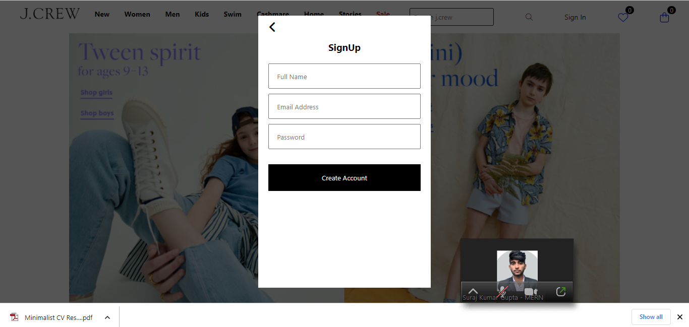

# TEAM JCREW

## Description
#### This is a sample application that demonstrates an E-commerce website using HTML, CSS and Javascript. The application loads products on local storage and displays them. Users can select to display products in a single category. Users can click on any product to get more information including pricing, reviews and rating.

#### Users can select items and add them to their shopping cart.

#### Also added the responsivness so user can use the site in any device they have.

## Features
- Update Home Page as per daily best offer.
- No, need to login for checking the product of website.
- Display data by using local storage of browser.
- Update and design to provide best User Experience.

## Site to be Made
 *[Click Here For Website Link](https://www.jcrew.com/in/)*.

## Glimpse of Jcrew
---
<h2>Glimpses of Buffer</h2>

 
 

  

## Team Members
1. Ansh Girdhar ( fw18_0096 )
2. Kishan Savaj ( fw18_0169 )
3. Ankit Parte ( fw18_0782 )
4. Shaik Sirajuddin ( fw18_0110 )
5. Vinod Chaudhari ( fw17_0447 )

## Tools and Language used
- Javascript
- HTML
- CSS
- Fevicon
- Font-awesome

## Site Made by Us
http://jcrew-project-clone.netlify.app/

## Copy this link to clone the Github Repository
https://github.com/vin9012d/Project-unit-3.git

## Video Link
https://drive.google.com/file/d/11yaIyDmM3DI1mLFinbL4xb_V-VCsMAR4/view?usp=sharing

## Thank You

